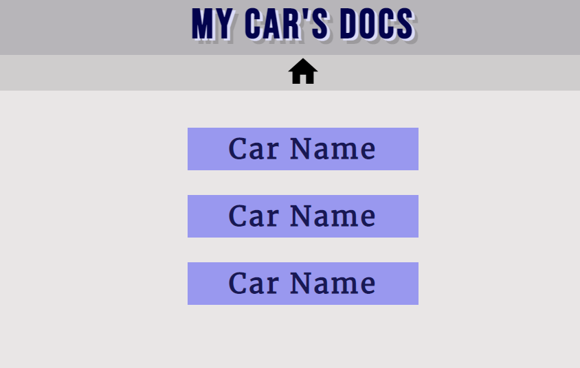
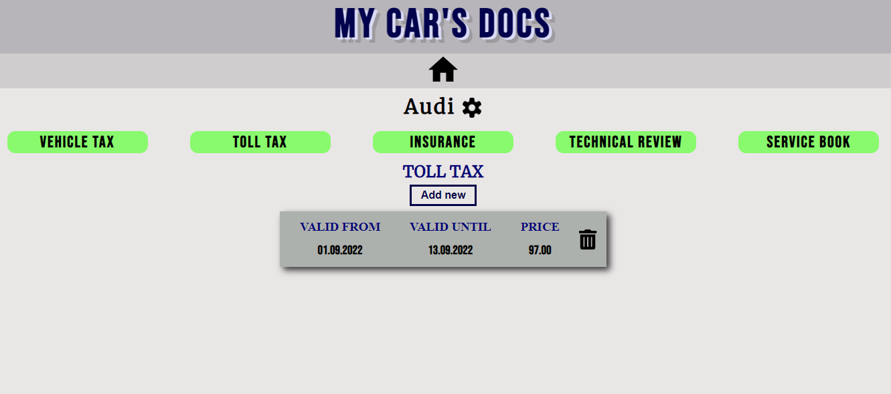
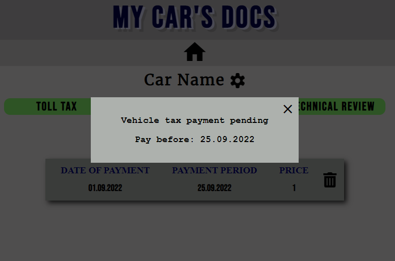

## Simple App where you can store all documents for your vehicle in one place - toll tax, vehicle insurance, vehicle tax, etc.
## Also, you get a notice 5 days before specific payment.
## It's made with HTML, CSS and React, using json-server and save the data in .json file.



To get a local copy of the code, clone it using git:

```
git clone https://github.com/92gahov/Car-Docs-2
cd Car-Docs-2
```

Install dependencies:

```
npm install
npm i concurrently
npm install -g json-server
```

Now, you can start a local web server by running:

```
npm start
```